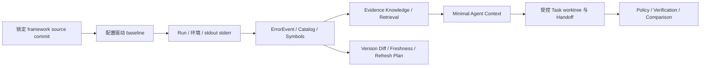

# 项目全景与业务理解

## 项目解决的问题

Framework Lab 面向需要学习和验证小众、快速变化框架的 Coding Agent 使用者。它将“固定源码版本、记录环境、运行基线、保存日志、提取结构化证据、生成受限上下文、受控验证任务、跟踪版本变化”组织成可复现工作流。

真实痛点不是“让模型自动修代码”，而是避免把不稳定的框架文档、机器环境和一次性试验结论误写成可靠知识。

## 目标用户与当前范围

- 目标用户：需要为框架任务准备可追溯证据的开发者或 Coding Agent 操作者。
- 已真实验证框架：NCom，且只在已记录 commit 和 Windows 环境上。
- 当前阶段：本地 TypeScript CLI 原型；没有线上产品、用户系统或多租户服务。

## 核心流程

## 主要模块

| 模块 | 解决的问题 | 真实边界 |
| --- | --- | --- |
| Baseline | 固定命令、环境、日志和结果 | 只运行配置声明的步骤 |
| ErrorEvent | 将常见日志转成结构化失败事件 | 不是根因分析或修复建议 |
| Catalog/Symbol | 只扫描 Git tracked 文件并建立结构索引 | 不复制源码，不做语义理解 |
| Knowledge/Context | 将受证据约束的结论放入最小上下文 | 非 RAG、非向量检索 |
| Controlled Task | 用独立 worktree、Policy 和验证计划约束修改 | Framework Lab 不自动写业务代码 |
| Learning/Version | 发布知识、追踪版本差异和失效范围 | 新知识仍需人工审核 |

## 与普通项目的区别

它不是框架官网、聊天机器人、自动修复平台或通用 CI。它把“框架行为结论”与 commit、环境、日志、Schema 和验证步骤绑定，刻意保留人工浏览器检查和外部 Agent 的责任边界。

## 已验证的案例

- Run 009 记录 NCom build 失败。
- Run 010 在同 commit、同环境、只移除冗余 Sass `additionalData` 的受控修复后，build 通过，而允许失败的 lint 仍如实保留为失败。
- 一个 NCom NCButton 任务完成 Policy、18 项自动验收、构建和 HTTP 检查；浏览器点击保持 `manual_required`。

证据见 `frameworks/ncom/reports/run-009-vs-run-010-cjk-sass-fix.md` 与 `frameworks/ncom/tasks/task-ncom-ncbutton-observable-event/verification-report.md`。

## 面试表达

推荐一句话：**我做的是一个本地 CLI 工作流，用可验证的源码版本、环境和运行证据约束 Coding Agent 的框架学习与任务验证，而不是把不确定结论交给模型自由生成。**

不要声称：已经实现自动修复、浏览器自动化、真实 Token 优化、RAG 或多框架产品化。
