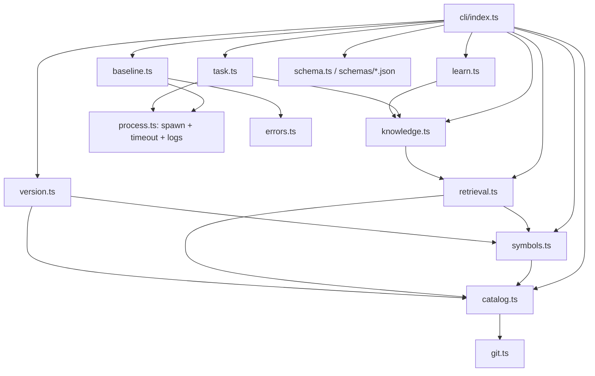

# 系统架构与核心调用链

## 架构边界

项目是 Node.js + TypeScript ESM CLI；入口是 `cli/index.ts`，没有前端、HTTP API、数据库或部署服务。`frameworks/<id>/` 保存框架配置和可追溯材料，Schema 由 Ajv 校验。

## 目录职责

| 位置 | 职责 |
| --- | --- |
| `cli/` | 命令入口和实现模块 |
| `schemas/` | 可机读输入/输出约束 |
| `frameworks/ncom/framework.yaml` | baseline、pnpm、源码与分析配置 |
| `frameworks/ncom/runs/` | Run 元数据、日志和报告；部分原始内容忽略 |
| `frameworks/ncom/catalog`、`symbols` | 本地派生 snapshot 与 diff |
| `frameworks/ncom/tasks` | 任务、Policy、验证、比较和 history |
| `test/` | Node test 回归测试 |

## 真实调用链：执行 NCom 基线

1. 用户运行 `pnpm framework-lab baseline run ncom`。
2. `cli/index.ts` 解析参数，`config.ts` 读取 `frameworks/ncom/framework.yaml`。
3. `baseline.ts` 采集 Node/npm/pnpm、Git commit 与 dirty 状态，生成唯一 run id。
4. `process.ts` 用 `spawn` 执行固定 pnpm，不拼接 shell 命令；stdout/stderr 分开写入日志，超时后终止子进程。
5. `errors.ts` 回读步骤日志，产生 `errors.json`；`report.ts` 输出事实型报告。
6. 产物写入 `frameworks/ncom/runs/<run-id>/`；Run 状态由 required/allow_failure/skip 规则决定。

## 真实调用链：受控 Coding Agent 任务

1. `task create` 将任务文本绑定到 Catalog/Symbol Snapshot、Context、Acceptance、Policy 和 Verification Plan。
2. `task prepare` 才创建 detached worktree，并先记录 before 证据。
3. `task handoff` 只生成外部 Agent 说明，不启动 Agent。
4. 外部修改后，`task inspect` 独立读取 Git diff 并应用 Change Policy。
5. `task verify` 运行配置验证，浏览器项目如不可自动观察则保留 `manual_required`。
6. `task compare` 对比 before/after ErrorEvent 和验证状态；不会自动 commit、merge 或 push。

## 架构取舍与风险

- 选择文件产物和 JSON Schema，优先可审阅、可复现和 Git 友好，而非早期引入数据库。
- 选择确定性检索和精确 hash，而非用 LLM 或模糊相似度判断框架事实。
- 主要风险：当前只实测 NCom；本地文件产物增长后的检索效率、并发写入和多框架兼容性尚未验证。

## 面试追问

- 为什么 `spawn` 比拼接 shell 字符串更适合 Windows 中文路径和参数边界？
- 为什么 HTTP 200 不能等同浏览器行为通过？
- 为什么 dirty worktree 不能只记录 commit？
