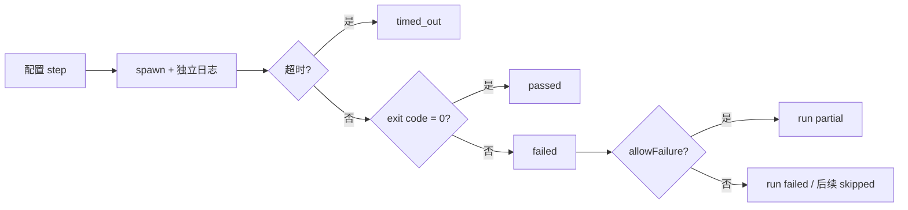

# 测试验证与质量保障

## 核心原则

“通过”必须说明验证层级、输入 commit、环境和可观察范围。静态检查、构建、HTTP、浏览器行为和人工体验是不同证据，不能互相替代。

## 验证分层

| 层级 | 项目中的实现 | 能证明什么 | 不能证明什么 |
| --- | --- | --- | --- |
| 单元/fixture 测试 | `test/*.test.ts`、Node test | 运行器、解析器、Catalog、Symbol、Task 等逻辑符合 fixture 预期 | NCom 在真实环境一定可用 |
| Schema 验证 | `schemas/*.schema.json` + Ajv | 产物结构、枚举和必填字段正确 | 内容语义或浏览器行为正确 |
| 静态质量门禁 | `pnpm lint`、`typecheck` | Framework Lab 源码的 lint/类型检查结果 | 下游框架构建或行为正确 |
| 构建/命令验证 | baseline、Task Verification Plan | 指定命令在指定 commit/环境的退出状态 | 所有功能或平台正确 |
| HTTP smoke | 受控开发服务、HTTP status 条件 | 服务就绪、指定 URL 可达 | 页面入口、样式、交互、控制台无错误 |
| 浏览器人工验证 | checklist、`browser_check` | 用户实际观察到的渲染或交互 | 自动化覆盖或跨浏览器兼容 |
| Agent A/B | v0.1.8 两个新会话记录 | 一次任务中 Context 可被使用 | 稳定 Token/质量提升 |

## 项目自身自动化测试

`package.json` 的 `pnpm test` 使用 `tsx --test` 运行以下模块测试：

- `framework-lab.test.ts`：配置加载、Run id、成功/失败/allow_failure/skipped/timeout、Windows `.cmd` 参数、dirty Git、报告。
- `errors.test.ts`：Sass、ESLint、Vite、TypeScript、Node、pnpm、generic 解析器、ANSI/CRLF、脱敏、fingerprint、首个阻塞错误和历史回放。
- `catalog.test.ts`：tracked-only、编码、分类、workspace、Markdown、示例、配置、rename、dirty 和确定性。
- `symbols.test.ts`：TS/TSX 声明、导入导出、公共 API、组件关系、diff 与 diagnostics。
- `knowledge.test.ts`、`retrieval.test.ts`、`learn.test.ts`：Evidence、Context、受限片段、预算、Learning Draft/Review/Publish。
- `task.test.ts`：worktree、Handoff、Change Policy、Verification Plan、Acceptance、HTTP、手动项和历史。
- `version.test.ts`：FrameworkVersion、Diff、Impact、Freshness、Refresh Plan。

最近一次已记录的全量回归为 `457 passed`，并通过 `pnpm lint`、`pnpm typecheck`、`pnpm build` 与 `git diff --check`。该数字是当前工作区记录的结果；今后每次运行应重新记录命令和实际总数。

## Baseline Runner 的验证模型

Baseline step 记录 command、args、cwd、开始/结束时间、duration、exitCode、stdout/stderr、`allowFailure` 和 timeout。

这让“lint 失败但允许失败”和“build 失败且阻塞”可区分。Run 010 是前者，Run 009 是后者。

## ErrorEvent 与失败分类

`errors.json` 不修改原日志，而是把失败日志按 parser 优先级转换为结构化事件：ESLint → Sass → Vite → TypeScript → Node → pnpm lifecycle → generic。

关键质量规则：具体错误优先于生命周期包装错误。Run 009 的首个阻塞错误是 Sass import failure，而不是 `ELIFECYCLE`；Run 010 只有 lint/lifecycle，build 通过，因此没有全局阻塞错误。

## 受控任务 Validator

Task 测试和真实任务都分为三个层次：

1. **Change Policy**：允许/禁止路径、lockfile/manifest 只读、文件数、diff 行数、untracked、binary、冲突标记、HEAD 与 submodule。
2. **Verification Plan**：命令、静态检查、HTTP、依赖顺序、超时、允许失败、before/after 阶段。
3. **Acceptance**：`file_exists`、`text_present`、`symbol_used`、`command_passes`、`http_status`、`manual_check`、`browser_check` 等逐项结果。

`acceptance.schema.json` 约束结果结构；`change-policy.schema.json` 约束可修改边界；`verification-plan.schema.json` 约束步骤和依赖。Schema 通过后仍要运行实际 Validator，不能只校验 JSON。

## 真实 NCom 验证案例

### Run 009 / Run 010

| 项目 | Run 009 | Run 010 |
| --- | --- | --- |
| install | passed | passed |
| lint | failed，允许失败 | failed，允许失败 |
| build | failed | passed |
| 总结 | failed | partial |
| 关键结论 | Sass import failure 是 blocking | Sass build failure 消失，仍有 lint 问题 |

该对照只说明已固定的 Windows/Node/pnpm/commit 条件下，单一配置修改与构建结果变化相关；不证明所有平台没有回归。

### NCButton 受控任务

真实任务记录：Policy passed；install、theme build、example build、dev server、HTTP 均 passed；18 项自动验收 passed；浏览器点击 `manual_required`；最终 `verification_partial`。

这是一条很重要的面试边界：自动验证成功不等于用户真实点击已完成。

## HTTP 与浏览器检查清单

推荐顺序：

1. 开发进程未提前退出，记录 PID/URL。
2. 实际端口监听。
3. 首页 HTTP status、Content-Type、长度和入口引用。
4. 至少一个静态资源 HTTP 请求。
5. 入口模块是否 500。
6. 人工确认非空白页、导航/组件、样式、交互、刷新、Console 和 Network。

Run 007 说明前四项可部分通过，而入口模块解析和浏览器页面仍失败。因此任何报告都必须分开写 `HTTP Smoke` 与 `Browser Behavior`。

## Agent 配对评测的质量边界

v0.1.8 的 A/B 实验至少应记录：同一 commit、独立 worktree、相同任务和修改边界、构建/服务/HTTP 状态、浏览器状态、实际变更文件。

该实验未记录精确 Token、时长、文件读取或搜索次数，所以这些字段只能为 `null`；不应用“节省 XX%”或“质量提升”表述。将来评测应预先定义任务、成功条件、失败分类、采集字段和重复次数。

## 当前覆盖不足与补足方向

- 仅 NCom 有真实框架验证；需要第二框架再讨论通用性。
- 浏览器为人工检查；若未来引入自动化，需保留人工结果并明确浏览器版本。
- Agent A/B 只有一次探索性对照；应重建候选 worktree、固定指标并重复实验。
- 性能、并发写入、长期产物规模和跨平台兼容未形成基线。
- 历史 Run 004–006 的部分完整 stdout 缺失，不能补写模拟日志。

## 面试回答框架

当被问“你怎么保证质量”时，按以下顺序回答：**输入版本和环境固定 → Schema/单测保证工具逻辑 → 命令与日志记录真实运行 → Policy/Acceptance 约束修改与结果 → HTTP 和浏览器证据分层 → 未观测的指标和人工项明确保留未验证。**
