# Agent 与 AI 应用实现

## 先给结论

Framework Lab 已实现的是**受控 Coding Agent 工作流的准备、约束、独立验证和证据留存**。它不在核心中调用 Codex/OpenAI API，不自动生成或修改框架代码，不自动接受、commit、merge、push，也没有 RAG、Embedding、向量数据库或浏览器自动化。

## 为什么项目仍然与 Agent 有关

陌生框架中的 Coding Agent 容易遇到版本漂移、上下文不足、读取范围失控、修改越界和“命令通过但页面未验证”。本项目把 Agent 放在受控流程的一环：先建立可定位知识和最小 Context，再用 Policy、Acceptance、Verification 与 Comparison 独立检查结果。

```mermaid
flowchart LR
  A[Task 文本] --> B[Catalog / Symbol / Knowledge Retrieval]
  B --> C[最小 Agent Context]
  C --> D[Task + Policy + Acceptance + Verification Plan]
  D --> E[detached worktree]
  E --> F[外部人工启动 Coding Agent]
  F --> G[inspect: Git diff / Policy]
  G --> H[verify: command / HTTP / Acceptance]
  H --> I[compare: before / after ErrorEvent]
  I --> J[人工确认或关闭任务]
```



## 已完成：最小 Context 与检索

- **位置**：`cli/lib/retrieval.ts`、`cli/lib/knowledge.ts`、`cli/lib/symbols.ts`、`cli/lib/catalog.ts`。
- **输入**：任务文本、锁定 commit、Catalog/Symbol Snapshot、已发布知识和可选 Run。
- **输出**：候选召回、透明评分、选中证据、带 commit/hash/行号的受限片段，以及 `context.md`/Manifest。
- **约束**：只读取 Catalog 登记文件；不将整文件塞入 Context；预算是字符数启发式估算；Scope 不匹配或内部/低完整度候选会降权或排除。
- **不是的东西**：不是 embedding、向量数据库、语义 RAG 或实时联网检索。

`context create --knowledge-first` 会优先引用已发布知识并记录 raw fallback。现有对照只说明知识单元可以被引用，不能说明一定减少真实模型 Token。

## 已完成：Task、Handoff 与权限边界

### Task

`task create` 将任务绑定到精确 source commit、Context、Acceptance、Change Policy 和 Verification Plan；`task prepare` 才创建 detached worktree。

### Handoff

`task handoff` 生成 Agent 指令，但不启动任何 Agent。真实 NCButton Handoff 明确：只允许改 `example/component/button/**`，禁止 `packages/**`、manifest 和 lockfile；要求 build、HTTP 与浏览器点击分别验证。

### Change Policy

Policy 会检查允许/禁止路径、最大改动文件/行数、lockfile/manifest、untracked 文件、binary、冲突标记、submodule 和基线 HEAD。它不信任 Agent 的文字自报，而是读取 worktree Git 状态。

## 已完成：Validator 与验证计划

Validation 分为：

1. **结构验证**：Schema 检查 Task、Policy、Acceptance、Plan 和产物形状。
2. **Policy 验证**：检查实际 diff 是否越界。
3. **Verification Plan**：执行指定 command、static check 或 HTTP step，支持依赖、timeout、allowFailure 和 before/after。
4. **Acceptance**：文件、文本、symbol、命令、HTTP 和手工/浏览器条件逐项写状态。
5. **Comparison**：比较 before/after ErrorEvent 和验证状态，形成事实型结论。

真实 NCButton 任务中，18 项自动 Acceptance 通过，但 `browser-click` 为 `manual_required`，所以最终是 `verification_partial`，而不是完全 accepted。

## 已完成：知识学习工作流

Learning 不直接让模型发布知识，而是：

```text
Topic → bounded Bundle → external Handoff → Draft → Evidence/Schema validate → manual review → Published Knowledge
```

- Bundle 限制证据和片段，不复制完整源码。
- Handoff 现在提供 `draft-template.json`、必填字段、枚举、Evidence id 限制、80 KiB 上限和预校验命令。
- `learn import --dry-run` 可预校验，不写入 Draft。
- Published Knowledge 与 Scope/Evidence 绑定；版本变化后可通过 Version Diff/Impact/Freshness 识别需复核项。

当前没有可证明的“外部 Agent 已成功自动完成 handoff → Draft import → review → publish”完整链路，因此不能写成已验证自动学习。

## 运行状态、超时与重试

- 命令运行器用 Node `spawn`，独立保存 stdout/stderr。
- timeout 后在 Windows 用 `taskkill /t /f` 终止进程树。
- baseline 支持 passed/failed/skipped/timed_out，允许失败步骤可形成 partial。
- Task 的开发服务 HTTP 检查在 timeout 内轮询就绪，避免刚启动时的连接失败被误记为框架失败。

当前没有面向 LLM 请求的 retry、最大 Agent step 数、Tool Calling retry 或会话状态机，因为项目不发起 LLM 调用。

## Codex CLI 的实际角色

Codex CLI 可以是外部执行者：用户将 Handoff 交给新的 Agent 会话，Agent 在受控 worktree 修改后，Framework Lab 再独立 inspect/verify。这个分工让 Agent 的实现行为和验证结论相互独立。

不能说 Framework Lab “集成 Codex API”或“自动编排 Codex”。目前仅有外部会话协作证据和 Handoff 文档。

## Agent 配对评测：已知与未知

v0.1.8 比较了同 commit 的无 Context/A 组与有 Context/B 组；两组均完成受限 NCButton example 修改、构建、开发服务和 HTTP。B 组的会话观察显示对核心源码、Props/事件、导出和文档的补充探索更少。

但没有精确 Token、耗时、读取量和搜索次数；浏览器真实点击也未完成。因此结论只能是一次 `exploratory-pass`，不能宣称稳定性能提升或代码质量提升。

## 未实现或规划外的能力

| 能力 | 当前状态 | 说明 |
| --- | --- | --- |
| OpenAI/Codex API 调用 | 未实现 | 核心不发起模型请求 |
| Tool Calling | 未实现 | 无工具 Schema 传给 LLM 的运行时 |
| 自主循环 Agent | 未实现 | 没有最大步数、自动重试或自动写代码 |
| RAG/Embedding/向量库 | 未实现 | 当前为确定性结构检索 |
| 自动浏览器测试 | 未实现 | 浏览器项保持人工验证 |
| 自动发布知识 | 未实现 | 必须经人工 review |
| 多框架并行 | 未验证 | 目前仅 NCom 有真实案例 |

## 面试回答

**问：这是不是 Agent 套壳？**

答：不是把聊天模型包一层 UI；核心价值是把框架任务的输入版本、允许修改范围、验证条件、日志和历史产物结构化。Agent 可以替换，但验证器和证据链保持独立。

**问：为什么不用完全自主 Agent？**

答：陌生框架任务的风险集中在错误上下文、越界改动和不可观察的浏览器行为。当前阶段先用受控 worktree、Policy、Acceptance 和人工关闭条件建立可信闭环；自主循环需要额外的权限、成本、重试和安全证据。

**问：这算 RAG 吗？**

答：不算。它只做 commit 绑定的确定性 Symbol/文档/示例关系检索和有限片段组装，没有 embedding、向量相似度或语义召回。
